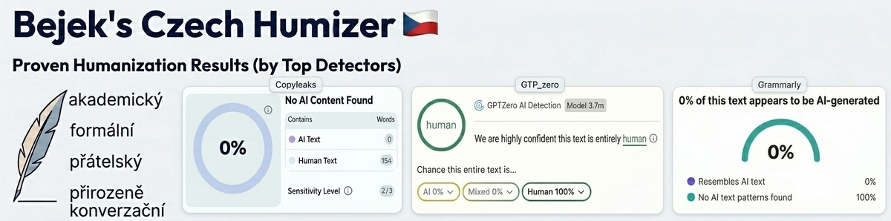

# 🇨🇿 Humanizer Czech



**Odstraň znaky AI-generovaného psaní z českého textu.**

První humanizer skill zaměřený specificky na český jazyk. Detekuje 27 vzorců typických pro AI-generovanou češtinu a přepisuje text tak, aby zněl přirozeně a lidsky.

> **Výsledky detektorů:** Vzali jsme těžce AI-generovaný text (19 z 27 vzorců detekováno), prohnali ho humanizerem a nechali otestovat top detektory. Copyleaks: 0% AI. GPTZero: "entirely human". Grammarly: 0% AI. Žádný detektor nepoznal, že text prošel přes AI.

## Smrt em dashi

Znáte ten dlouhý pomlčkový znak **—** co je doslova v každém AI textu? Ten, co normální Čech nikdy v životě nenapíše, protože na klávesnici prostě zmáčkne `-`? Tak ten tady automaticky mizí. Je to na první pohled nejviditelnější znak AI generovaného textu a je úplně všude. Tohle je první humanizer, který ho řeší natvrdo jako globální pravidlo.

## Co to dělá

- **Zakazuje em dash (—)** - nahrazuje ho běžnou pomlčkou (-), kterou reálně píše každý Čech
- Identifikuje české AI klišé ("V dnešní době", "Je důležité zdůraznit", "Závěrem lze konstatovat"...)
- Detekuje anglický slovosled, kalky, nominalizaci a další česko-specifické vzorce
- Odstraňuje nafouklý jazyk, trpný rod, vágní atribuce
- Přidává osobnost a autentický hlas
- Dual-pass systém: přepíše → zkontroluje → opraví znovu
- **4 styly výstupu:** akademický, formální, přátelský, konverzační

## Instalace

### Claude Code (doporučeno)

```bash
# Naklonuj do složky skills
mkdir -p ~/.claude/skills
git clone https://github.com/bejek/humanizer-czech.git ~/.claude/skills/humanizer-czech
```

Pak v Claude Code použij `/humanizer-czech` následovaný textem k humanizaci.

### Claude.ai (Projects)

1. Stáhni [SKILL.md](SKILL.md) (nebo celý ZIP přes zelené tlačítko "Code")
2. V claude.ai otevři Settings → Customize → Skills
3. Nahraj SKILL.md jako nový skill

### ChatGPT, Gemini, Copilot, Mistral a další LLM

1. Otevři [PROMPT.md](PROMPT.md)
2. Zkopíruj celý obsah
3. Vlož jako systémový prompt (system instructions) nebo na začátek konverzace
4. Pošli text k humanizaci

## Příklad

**Vstup (typický AI text):**
> V dnešní rychle se měnící digitální době je stále důležitější věnovat pozornost oblasti umělé inteligence. Je důležité zdůraznit, že AI představuje revoluční technologii, která zásadním způsobem mění krajinu moderního podnikání.

**Výstup (styl: přátelský):**
> AI v podnikání řeší firmy teď, ne za pět let. Gartner říká, že ji testuje 65 % středních firem v Evropě, ale upřímně - většina z nich teprve zkouší, co to vlastně umí.

## 27 detekovaných vzorců

| # | Vzorec | Příklad |
|---|--------|---------|
| 1 | Nafouklé otevírací fráze | "V dnešní době..." |
| 2 | Přehnané zdůrazňování | "Je důležité zdůraznit..." |
| 3 | Formulaické závěry | "Závěrem lze konstatovat..." |
| 4 | Nadužívání spojek | "Nicméně", "Kromě toho", "V neposlední řadě" |
| 5 | Přehnaná formálnost | "Bylo dosaženo", "Je zapotřebí" |
| 6 | Pravidlo tří | Trojice přídavných jmen/příkladů |
| 7 | Propagační jazyk | "Revoluční", "Inovativní", "Komplexní řešení" |
| 8 | Vágní atribuce | "Odborníci se shodují", "Studie ukazují" |
| 9 | Nadužívání pomlček | Přehnané em dash (—) |
| 10 | Přehnané formátování | Tučné nadpisy v seznamech |
| 11 | Emoji dekorace | Emoji v nadpisech |
| 12 | Chatbot artefakty | "Skvělá otázka!", "Rád pomohu" |
| 13 | Synonymické kolečko | Společnost/firma/podnik/korporace |
| 14 | Falešné rozsahy | "Od startupů po korporace" |
| 15 | Generické závěry | "Budoucnost vypadá slibně" |
| 16 | Výplňové fráze | "Za účelem dosažení", "Vzhledem k tomu, že" |
| 17 | Anglický slovosled | Porušení aktuálního členění větného |
| 18 | Monotónní rytmus | Všechny věty podobné délky (nízká burstiness) |
| 19 | Přivlastňovací zájmena | "Otevřel své oči a vzal svůj telefon" |
| 20 | Anglické kalky | "Pojďme se ponořit do", "na denní bázi" |
| 21 | Nadměrná nominalizace | "Došlo k realizaci implementace" |
| 22 | Meta-komentáře | "V tomto článku se podíváme na..." |
| 23 | Falešná vyváženost | "Na jedné straně... na druhé straně..." |
| 24 | Ukazovací zájmena | "Tento problém... Tato situace... Tyto faktory..." |
| 25 | Copula avoidance | "Představuje klíčový nástroj" místo "je" |
| 26 | Sendvičová struktura | Úvod – 3 body – závěr vždy |
| 27 | Tautologická zdvojení | "různé a rozmanité", "efektivní a účinné" |

## 4 styly výstupu

- **Akademický** - odborný, precizní, pro výzkum a akademické práce
- **Formální** - profesionální, pro firemní komunikaci a produktové texty
- **Přátelský** - teplý tón, pro blogy, newslettery, sociální sítě
- **Konverzační** - neformální, jako bys psal kamarádovi

## Poděkování

Inspirováno projektem [humanizer](https://github.com/blader/humanizer) od [@blader](https://github.com/blader) - původní anglická verze s 10k+ stars. Česká verze přidává 27 vzorců specifických pro český jazyk a systém 4 stylů výstupu.

Vychází také z [Wikipedia: Signs of AI writing](https://en.wikipedia.org/wiki/Wikipedia:Signs_of_AI_writing).

Vzorce 17-27 identifikovány cross-referencí výstupů z Claude, ChatGPT a Gemini.

## Licence

[MIT](LICENSE) - používej jak chceš, komerčně i nekomerčně.

---

Vytvořeno s pomocí [Claude Code](https://claude.ai/claude-code)
